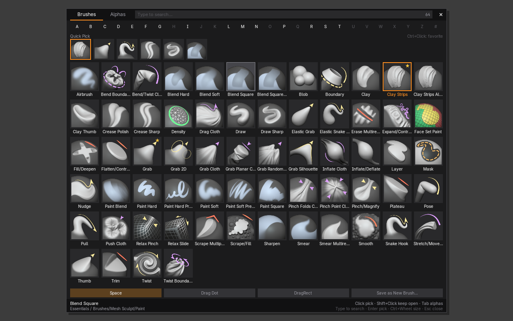
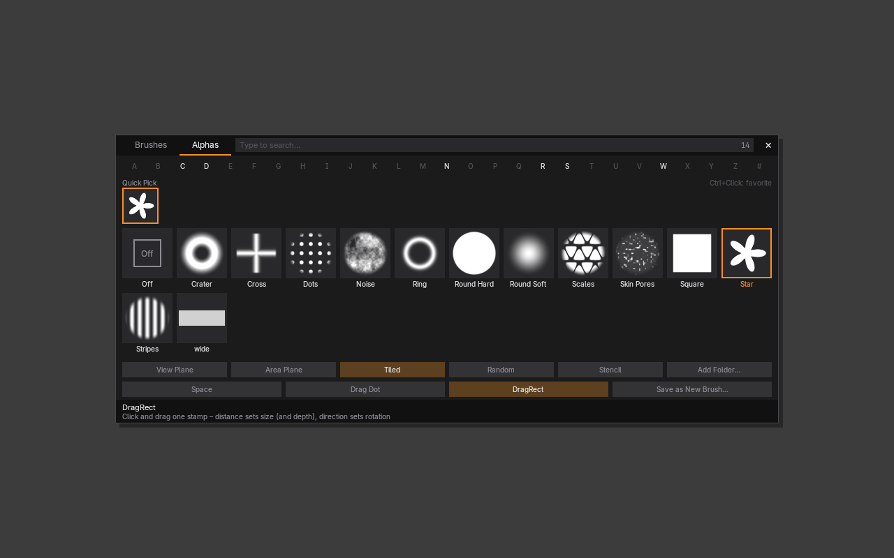

# Brush & Alpha Palette for Blender

A ZBrush-style popup palette for Blender 4.3+ (tested on 4.5 LTS and 5.0). One hotkey shows every brush
as a large thumbnail under the mouse, and one click picks it. Alphas work the same way: one click
puts an alpha on the current brush, with no texture, image, or mapping setup.



## Features

**Brushes** (`Alt+B`, or the brush icon in the tool header)
- Big thumbnails for every brush in the current mode: Sculpt, Texture/Vertex/Weight Paint, Sculpt Curves
  and Grease Pencil modes.
- Lists the *Essentials* brushes, brushes in your **user asset libraries**, and brush assets in the open
  file.
- **Quick Pick** row with your favorites (Ctrl+Click a brush to star it) and recently used brushes.
- **A–Z letter bar** and **type-to-search**. Typing `cl` shows Clay, Clay Strips, Clay Thumb, and so on.
  Press Enter to pick the first match.
- The active brush is outlined in orange. Hover a brush to see its library and catalog.

**Alphas** (`Alt+A`, Tab inside the palette, or the alpha icon in the tool header)
- Shows every image in your alpha folders (png, jpg, tif, exr, psd, tga, …). 12 procedural starter alphas
  are generated the first time, so the palette works right away.
- One click on an alpha:
  1. creates or reuses an Image texture for that file,
  2. loads the image as Non-Color,
  3. assigns it to the brush (`texture` in Sculpt, `mask_texture` in Texture Paint),
  4. sets the mapping (Area Plane by default) and the extension (Clip, or Repeat when Tiled).
- Mapping buttons (View Plane / Area Plane / Tiled / Random / Stencil) sit directly in the palette.
- **Off** removes the alpha. **Add Folder…** adds your own alpha library (for example your ZBrush alphas).



**Stroke buttons** (in both tabs and in the sidebar): **Space** (normal stroke), **Drag Dot** (one stamp you
slide into place) and **DragRect** (Blender's *Anchored* stroke, like ZBrush's DragRect). With DragRect you
click and hold, and the drag distance sets the size of the stamp (bigger stamp = deeper/stronger result) and
the drag direction sets its rotation. Strength itself is the brush Strength (`Shift+F`).

### Your own brushes
Blender 4.3+ stores brushes as assets, and you can make your own:
1. pick a brush, change its settings (alpha, stroke, strength, falloff…),
2. click **Save as New Brush…** in the palette or the sidebar (Blender's *Duplicate Asset* dialog),
   give it a name, a library and a catalog.

Saved brushes go into a user asset library (*Preferences › File Paths › Asset Libraries*; Blender's default
is *User Library*). The alpha image is packed into the brush file, so the brush works anywhere. The palette
picks up new brushes automatically, and brush assets marked in the current .blend are listed too.

### About the built-in (Essentials) brushes
Since Blender 4.3, brushes from asset libraries are *linked*, and Blender does not let a linked brush use a
local texture. So the first time you apply an alpha to one of them, the add-on makes a local copy named
`<Brush> Alpha`, for example `Clay Strips Alpha`, and switches to it. The copy is saved in your .blend file
and appears in the palette. Applying more alphas to the same brush reuses that copy.

## Palette controls

| Input | Action |
| --- | --- |
| Click | Pick the brush or alpha and close |
| Shift+Click | Pick and keep the palette open |
| Ctrl+Click | Add or remove a favorite (Quick Pick) |
| Type / Backspace | Search (Ctrl+Backspace clears) |
| A–Z bar | Show only names starting with that letter |
| Enter | Pick the highlighted or first match |
| Arrow keys | Move the highlight |
| Wheel / Ctrl+Wheel | Scroll / change thumbnail size |
| Tab | Switch between Brushes and Alphas |
| Esc, right click, click outside, or the hotkey again | Close |

Middle mouse still navigates the viewport while the palette is open.

## Install

1. Zip the `brush_palette` folder. You can also run `blender --command extension build` inside it.
2. In Blender: *Edit › Preferences › Get Extensions › ▾ › Install from Disk…* and choose the zip.
   On older setups, use *Add-ons › Install…*.
3. Enter Sculpt Mode and press `Alt+B`.

The sidebar also has a **Palette** tab (`N` panel) showing the current brush and alpha.

## Preferences
- Thumbnail size, column count, name labels, and whether to close after picking.
- Include user asset libraries and current-file brushes.
- Alpha folders (with or without subfolders), default mapping, an optional stroke method to set when an
  alpha is applied (e.g. *Anchored*, like ZBrush's DragRect), and Non-Color loading.
- Hotkeys. Rebind them to `B` if you want ZBrush muscle memory.
- *Refresh Thumbnails* clears the thumbnail cache. Thumbnails are cached on disk, and brush libraries are
  only re-read when their files change.

## Development

`tests/run_tests.py` runs headless with the `bpy` module from PyPI. It enables the add-on in a throw-away
user folder and checks brush listing and activation, alpha thumbnails, alpha application (including the
local-copy logic), the palette layout and hit testing, and drives the palette's event handling with synthetic
mouse/keyboard events (search, letter bar, Enter, arrows, favorites, scrolling, Tab, mapping chips, closing):

```sh
pip install bpy==5.0.1        # or 4.5.x
python tests/run_tests.py --screenshot-dir /tmp/shots   # screenshots need EGL (libegl1)
```

Code layout (`brush_palette/`):

| File | Purpose |
| --- | --- |
| `brushes.py` | Finds brush assets per mode (Essentials, user libraries, current file), indexes and caches them, activates them |
| `alphas.py` | Scans alpha folders, makes thumbnails, applies or removes alphas, generates starter alphas |
| `palette.py` | The modal popup: layout and hit testing, GPU drawing, input handling |
| `thumbs.py` | Thumbnail pixels, disk cache, GPU textures |
| `ui.py` | Sidebar panel, tool header buttons, helper operators |
| `prefs.py`, `keymaps.py` | Preferences, favorites and recents, hotkeys |
