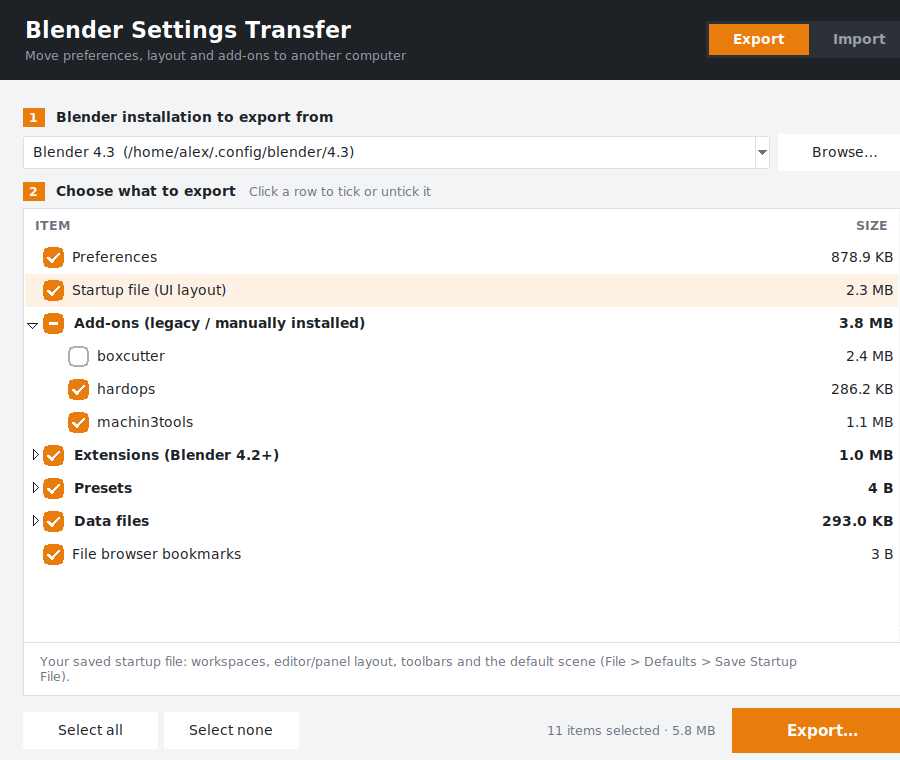

# Blender Settings Transfer



Move your whole Blender setup to another computer (or a fresh install) in one
go — and **choose exactly what to take with you**.

It exports your Blender user folder into a single `.zip` package and imports it
on the other PC. Blender opens with everything already set up: no "Load
previous settings" and no reinstalling add-ons one by one.

## What can be transferred

Every item can be ticked on/off individually — each add-on, each extension,
each preset folder separately.

| Item | What it contains |
|---|---|
| **Preferences** (`userpref.blend`) | Everything in *Edit › Preferences*: theme, keymap, **which add-ons/extensions are enabled** and their settings, input, viewport, file paths, extension repositories |
| **Startup file** (`startup.blend`) | Your **UI layout**: workspaces, editor and panel arrangement, toolbars, default scene (what you saved with *File › Defaults › Save Startup File*) |
| **Add-ons** | Add-ons installed from `.zip`/`.py` (`scripts/addons`) |
| **Extensions** (Blender 4.2+) | Extensions from extensions.blender.org or installed from disk |
| **Presets** | Custom keymaps, themes, render/camera/operator presets … |
| **Startup scripts / Python modules** | `scripts/startup`, `scripts/modules` |
| **Data files** | Custom MatCaps, studio lights, HDRIs, fonts (`datafiles`) |
| **Bookmarks / Recent files** | File browser bookmarks and *Open Recent* list |

Caches, `__pycache__`, `.blend1` backups and platform-specific extension wheel
folders are skipped automatically (Blender recreates them).

> **Tip:** installed add-ons/extensions only show up as *enabled* if you also
> transfer **Preferences** — that is where Blender remembers which ones are on.

## Download (no Python needed)

| System | File | How to start |
|---|---|---|
| **Windows** 10/11 | `BlenderSettingsTransfer.exe` | Double-click. |
| **macOS** 11+ (Intel & Apple Silicon) | `BlenderSettingsTransfer-macOS.zip` | Unzip, move *Blender Settings Transfer* to Applications, open it. |

Get them from the repository's **Releases** page, or from the latest
**Actions › Build Blender Settings Transfer** run (section *Artifacts*).

The apps aren't code-signed (that needs paid developer certificates), so the
first launch shows a warning:

- **Windows** – "Windows protected your PC": click **More info › Run anyway**.
- **macOS** – "can't be opened because Apple cannot check it": right-click the
  app › **Open** › **Open**. (Or in Terminal:
  `xattr -dr com.apple.quarantine "/Applications/Blender Settings Transfer.app"`.)
  You only need to do this once.

### Building the apps yourself

The GitHub workflow `.github/workflows/blender-settings-transfer.yml` builds
both on every push. Push a tag such as `bst-v1.0.0` to publish a Release.
Manual build (run it on the system you're building for):

```bash
pip install pyinstaller
pyinstaller --onefile --windowed --name BlenderSettingsTransfer blender_settings_transfer.py   # Windows
pyinstaller --windowed --name "Blender Settings Transfer" blender_settings_transfer.py        # macOS
```

### Running from source

Python 3.8+ with the standard library only. `python3 blender_settings_transfer.py`
(on Windows `run_windows.bat`). On Linux the window needs `python3-tk`; the
command line works without it.

## Using the GUI

**On the old PC — Export tab**
1. Pick the Blender version (found automatically; use *Browse…* for portable installs).
2. Click rows to tick/untick what you want. Click the arrows to expand groups
   and pick single add-ons.
3. Click **Export…** and save the `.zip` (USB stick, cloud drive, …).

**On the new PC — Import tab**
1. Install Blender, but **don't start it yet** (or close it).
2. **Open…** the `.zip`.
3. Choose the target: an existing installation, or just type a version such as
   `4.2` / `4.3` — the folder is created if it doesn't exist.
4. Tick what to import and click **Import**. Start Blender. Done.

Anything that gets replaced is first saved to a backup zip next to the version
folder (e.g. `4.2_backup_20260927-120000.zip`), unless you untick *Back up*.

Blender must be **closed** while importing — it saves preferences on exit and
would overwrite the imported ones.

## Command line

```bash
python blender_settings_transfer.py installs                 # show Blender folders found
python blender_settings_transfer.py list                     # show items + ids (newest Blender)
python blender_settings_transfer.py list my_setup.zip        # show what's inside a package

# export everything / only some items (group ids, full ids or short names)
python blender_settings_transfer.py export my_setup.zip
python blender_settings_transfer.py export my_setup.zip --version 4.2 --include preferences startup addons
python blender_settings_transfer.py export my_setup.zip --exclude recent_files node_wrangler

# import (defaults to the package's Blender version)
python blender_settings_transfer.py import my_setup.zip
python blender_settings_transfer.py import my_setup.zip --version 4.3 --exclude recent_files -y
python blender_settings_transfer.py import my_setup.zip --blender-dir "D:/Blender/portable"
```

## Where Blender keeps these files

| OS | Folder |
|---|---|
| Windows | `%APPDATA%\Blender Foundation\Blender\<version>\` |
| macOS | `~/Library/Application Support/Blender/<version>/` |
| Linux | `~/.config/blender/<version>/` (Flatpak: `~/.var/app/org.blender.Blender/config/blender/`) |

`BLENDER_USER_RESOURCES` is respected if set. For a portable Blender, use
*Browse…* / `--blender-dir` and point it at the `portable` folder.

## Notes

- Moving to a **newer** Blender version generally works; moving to an older one
  may not (older Blender can't always read newer `.blend` files).
- Add-ons that ship compiled code for one OS may not work on a different OS.
- File paths saved in preferences (e.g. asset libraries, temp folder) are copied
  as-is; adjust them in Preferences if the drive letters differ.
