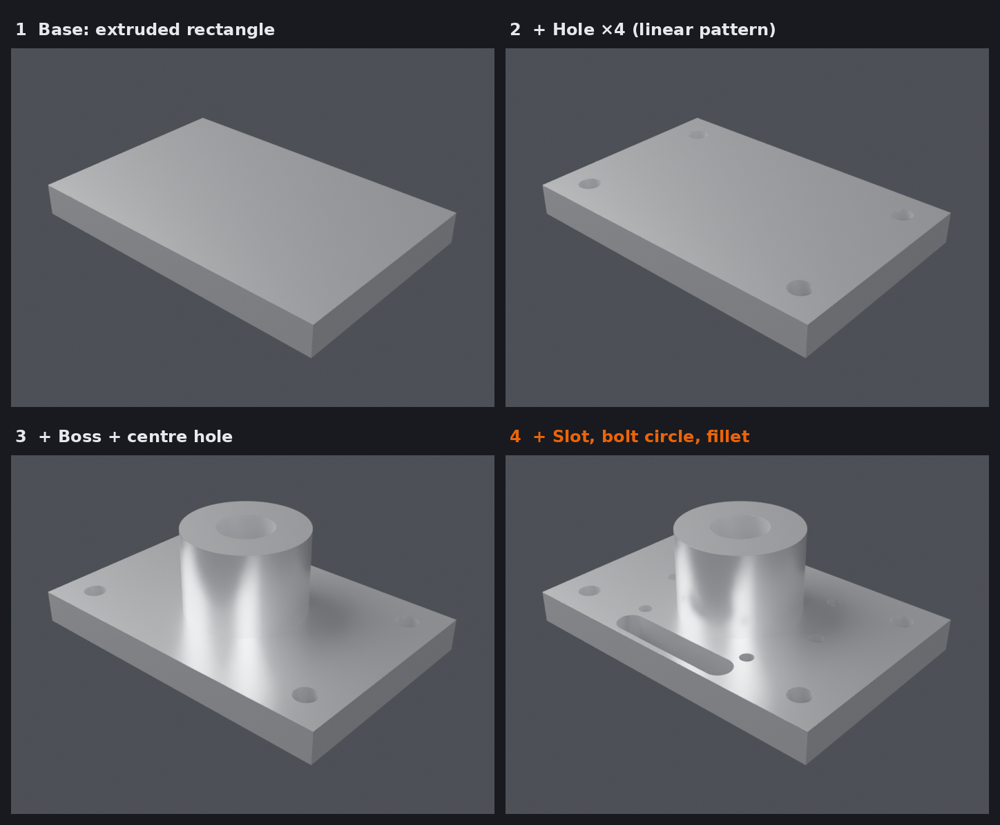

# Fox Parametric

**CAD-style feature history inside Blender.** Build parts from features like
*Extrude, Revolve, Hole, Fillet, Chamfer, Mirror* and edit any step later: the
model rebuilds instantly.



## Why not just use Fusion?

Because your model never leaves Blender:

- **Hybrid modelling.** Use a mesh you modelled by hand as the base, then put
  precise holes, cuts, fillets and patterns on top, and keep editing both. CAD
  tools can't do organic bases like that.
- **Animatable parameters.** Every dimension can be keyframed (hover and press
  `I`) or driven by a driver (right-click › *Add Driver*). You can render a lid
  opening, a gear with a changing tooth count, or a shelf growing.
- **Nothing locked in.** Each feature is a normal Blender modifier plus a
  hidden tool object. A `.blend` opens and renders correctly on a PC *without*
  the add-on; only the editable history needs it.
- **It's a real Blender object.** Materials, UVs, Cycles/Eevee, Geometry
  Nodes, sculpting and animation all work on it. There's no export and
  re-import between tools.

## Install

Blender **4.2 or newer**. Tested on 4.2 LTS and 5.0.

1. Download `fox_parametric-0.1.0.zip`.
2. *Edit › Preferences › Get Extensions › ⌄ (top right) › Install from Disk…*
   and pick the zip. Or just drag the zip into the Blender window.
3. Open the sidebar in the 3D Viewport (`N`) and find the **Fox** tab.

## Quick start

1. **Fox tab › Box** (or *Add › Mesh › Fox Part*). You get a base block.
2. Click **+** and choose **Hole**. It's placed on the top face, in the middle.
3. Change *Diameter*, tick *Through All*, and set **Pattern › Linear** with
   *Count U = 3*. There are now three holes.
4. **+ › Fillet** rounds all sharp edges.
5. Click any earlier feature in the **History** list and change its values;
   everything after it updates.

### The History list

| Button | What it does |
|---|---|
| **+** / **−** | Add a feature after the selected one / delete it |
| ⧉ | Duplicate the selected feature |
| ▲ ▼ | Move a feature earlier / later in the history |
| ↶ | **Roll back** to the selected feature: later ones are switched off, like dragging Fusion's timeline marker |
| ↷ | Roll forward (show everything again) |
| 👁 | Suppress a single feature |

### Features

| Feature | Settings |
|---|---|
| **Extrude** | Sketch profile (rectangle, circle, polygon, slot) on the Top / Front / Side plane with offset, position and rotation. Distance: one side, reverse, symmetric. Operation: Join / Cut / Intersect. |
| **Revolve** | Profile revolved around the sketch's U or V axis, any angle. |
| **Hole** | Diameter, depth or *through all*, flip direction. |
| **Pattern** | Part of Extrude / Revolve / Hole: *linear* grid (count and spacing in U and V) or *circular* (count, total angle). |
| **Fillet / Chamfer** | Size, segments, all edges or only edges sharper than an angle. |
| **Mirror** | X / Y / Z around the part's origin, optionally cutting the other half away. |

### Hybrid: start from your own model

Select any mesh and click **Make Part From Mesh**. Your mesh becomes the
base (*Your Mesh* in the history). Tab into Edit Mode and model it freely;
all features after it stay parametric.

A generated base (box, cylinder, revolve) is rebuilt from its numbers. To
shape it by hand, select it and click **Edit Base By Hand**: it becomes a
normal mesh and later features stay parametric.

### Other buttons

- **Smooth Shading** (on by default): curved surfaces are smooth and edges
  sharper than the angle stay crisp.
- **To Mesh**: bakes everything into a normal mesh and removes the history.
- **Rebuild**: rebuilds the part from its history. Normally that happens
  automatically.

## How it works

Every feature after the base is **one modifier** on the part, named
`Fox:<id>`, kept in history order at the top of the modifier stack. Sketch
features (extrude, revolve, hole) create a hidden *tool object* (in the
**Fox Tools** collection, parented to the part) holding the generated solid,
used by an exact **Boolean** modifier. Fillets and chamfers are **Bevel**
modifiers, and mirror is a **Mirror** modifier. You can add your own modifiers
below ours; they're kept.

Because fillets pick edges by angle, not by name, they don't break when you
change earlier features. That's the "topological naming problem" that makes
CAD tools lose edge selections.

## Limitations (v0.1) and ideas for next versions

- Sketches are single shapes with numbers. There's no free-hand sketch with
  constraints yet. Next: sketch from a Blender curve, then a constraint solver.
- Fillets choose edges by angle. Next: "only edges created by feature X".
- No viewport drag handles (gizmos) yet.
- Not yet: shell, sweep, loft, draft, threads, a variables table (global
  named dimensions), STEP export.

## Development

```bash
# with Blender
blender --background --factory-startup --python tests/test_fox.py
blender --background --factory-startup --python tests/test_ui.py
# or with the bpy module from PyPI
pip install bpy==4.2.* && python tests/test_fox.py && python tests/test_ui.py
```

Packaging: zip the *contents* of `fox_parametric/` (the manifest must be at
the zip root), or run `blender --command extension build` inside it.

License: GPL-3.0-or-later (required for Blender add-ons).
